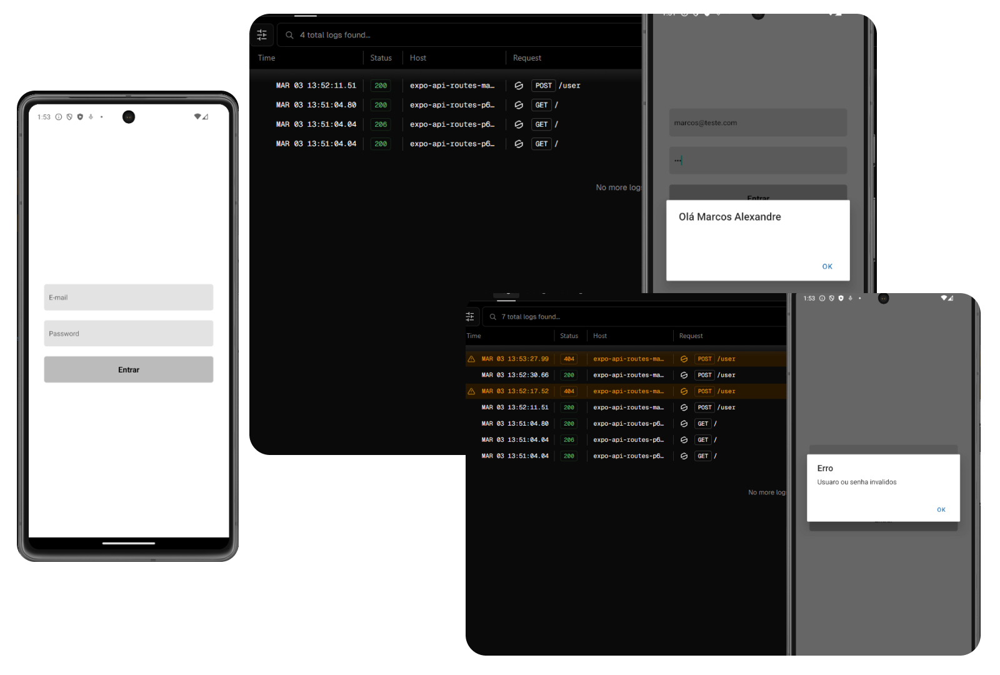

# Expo API Routes 📱🔗

Este é um projeto de exemplo que demonstra como usar o Expo Router V3 e uma novidade do EXPO 50, para criar um aplicativo móvel React Native com um backend integrado.




## Descrição

O Expo API Routes é um projeto de exemplo que mostra como desenvolver um aplicativo móvel React Native com um backend integrado usando o Expo Router V3. Ele inclui exemplos de criação de endpoints, manipulação de requisições e respostas, e implantação usando a plataforma Versel.

## Funcionalidades 🛠️

- Criação de endpoints com Expo Router V3.
- Manipulação de requisições e respostas.
- Implantação usando a plataforma Versel.

## Tecnologias Utilizadas 💻

- React Native
- Expo versão 50
- Expo Router V3
- Versel

## Como Usar 🚀

### Pré-requisitos ✅

- Node.js
- npm ou yarn
- Expo CLI

### Instalação 📦

1. Clone o repositório:

```
git clone https://github.com/anjosmarcos/expo-api-routes.git

```

2. Navegue até o diretório do projeto:

```
cd expo-api-routes
```

3. Instale as dependências:

```
npm install 
```

ou

```
yarn install
```

### Execução ▶️

Para executar o projeto em seu ambiente de desenvolvimento local, você pode usar o seguinte comando:

```
npm start
```

ou

```
yarn start
```

Isso iniciará o servidor de desenvolvimento Expo.

### Implantação 🚀

Para implantar o backend do projeto usando Versel, siga estas etapas:

1. Certifique-se de ter uma conta no [Versel](https://vercel.com/).
2. Instale o Versel CLI globalmente:

```
npm install -g vercel
```

ou

```
yarn global add vercel
```

3. Faça login na sua conta Versel:

```
vercel login
```

4. Crie uma build do projeto:

```
npm run versal-build
```

ou

```
yarn versal-build
```

5. Implante o projeto:

```
vercel
```

Siga as instruções no terminal para configurar e implantar o projeto.

## Contribuição 🤝

Contribuições são bem-vindas! Se você quiser contribuir com melhorias, novas funcionalidades ou correções de bugs, sinta-se à vontade para abrir uma issue ou enviar um pull request.

## Licença 📝

Este projeto é licenciado sob a [Licença MIT](https://opensource.org/licenses/MIT).

---

Esse README.md fornece uma visão geral do projeto, explica como instalar e usar, e fornece informações sobre como contribuir e a licença do projeto. Certifique-se de personalizá-lo conforme necessário para o seu projeto específico.